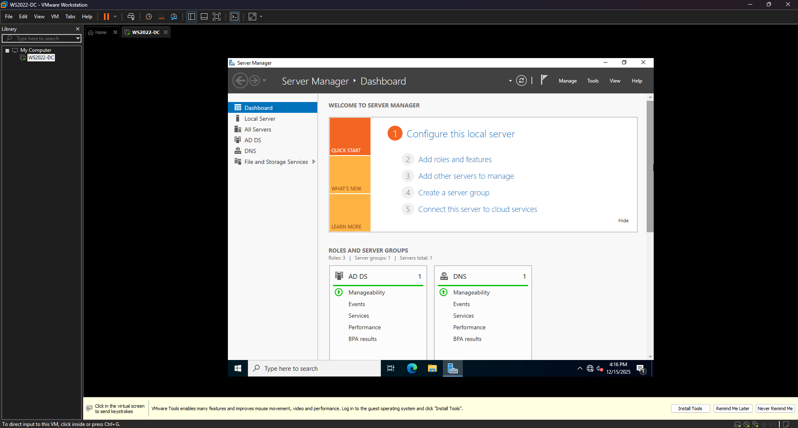
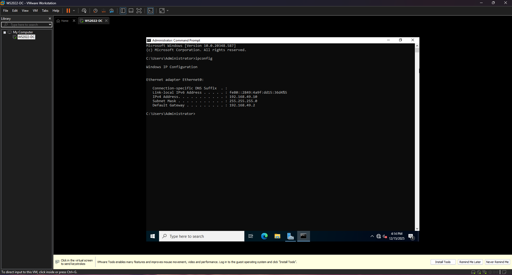
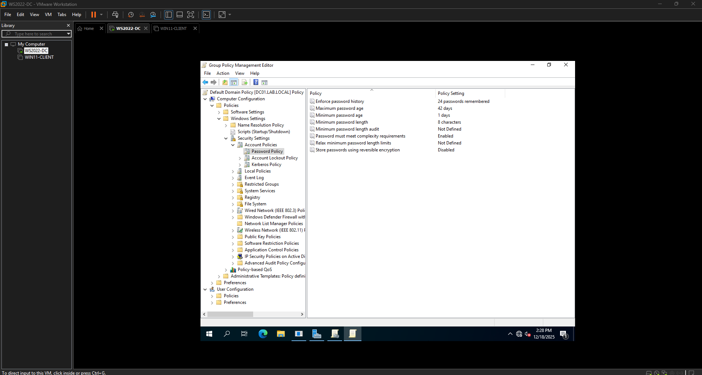
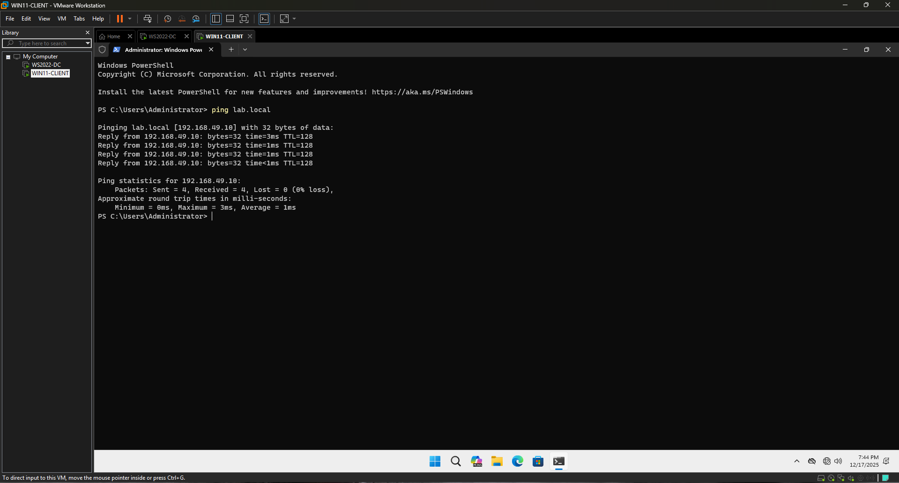
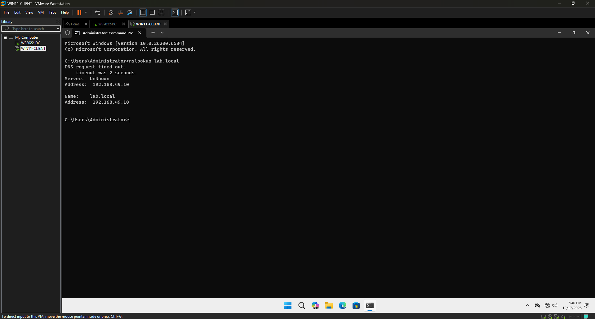
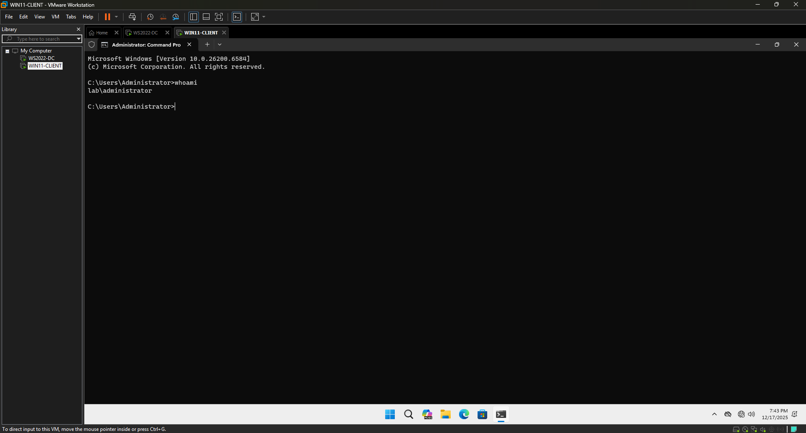

# Windows Server 2022 Active Directory Home Lab

## Overview
This project documents a hands-on Windows Server 2022 home lab built to simulate a small enterprise Active Directory environment. The lab focuses on domain services, DNS configuration, organizational unit (OU) design, and user management using industry best practices.

## Environment
- Hypervisor: VMware Workstation
- Server OS: Windows Server 2022
- Domain: lab.local
- Server Name: DC01
- Network: NAT with static IPv4 addressing

## Key Features Implemented
- Installed and configured Active Directory Domain Services (AD DS)
- Promoted server to Domain Controller
- Configured DNS integrated with AD
- Assigned static IPv4 address following DC best practices
- Created Organizational Units:
  - Lab_Users
  - Lab_Computers
  - Lab_Admins
- Created and managed domain user accounts
- Enforced domain password policies
- Troubleshot DNS and DHCP conflicts in a virtualized environment

## Skills Demonstrated
- Active Directory (AD DS)
- Windows Server 2022 Administration
- DNS Configuration
- Group Policy Fundamentals
- Virtualization (VMware)

## Screenshots

### Server Manager – AD DS Installed

### Active Directory OU Structure

### Static IPv4 and DNS Configuration

### Domain Password Policy Enforcement

## Windows 11 Client Integration

A Windows 11 client machine was added to the lab environment to simulate a real enterprise workstation joining an Active Directory domain.

### Client Configuration
- Client OS: Windows 11
- Machine Name: WIN11-CLIENT
- Joined Domain: lab.local
- Hypervisor: VMware Workstation
- Network: Host-only / NAT (VMnet) with domain-based DNS

### Key Tasks Completed
- Created a Windows 11 client VM
- Configured DNS on the client to point to the Domain Controller
- Resolved DNS and network profile issues preventing domain join
- Successfully joined the client to the `lab.local` domain
- Verified domain authentication using domain credentials (`lab\administrator`)

### Validation

- Confirmed DNS resolution using `ping lab.local`

- Verified DNS name resolution using `nslookup`

- Verified domain authentication context using `whoami`

This step completed the core Active Directory lab by demonstrating domain-joined client functionality.

## Status
🚧 Ongoing — future additions will include Group Policy Objects (GPOs), additional client machines, and security hardening.

## Lessons Learned
- Importance of static IP and DNS configuration before promoting a Domain Controller
- How domain password policies override local expectations
- Common DNS and DHCP issues in NAT-based virtual environments
- Practical OU design for scalable user and computer management
