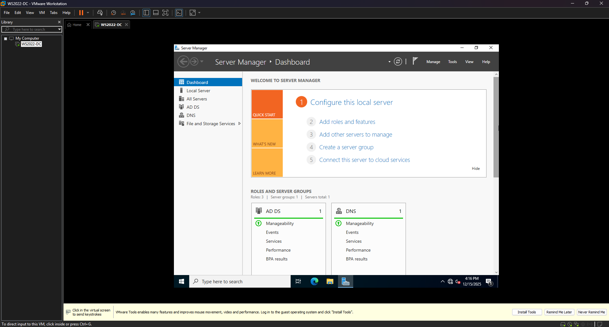
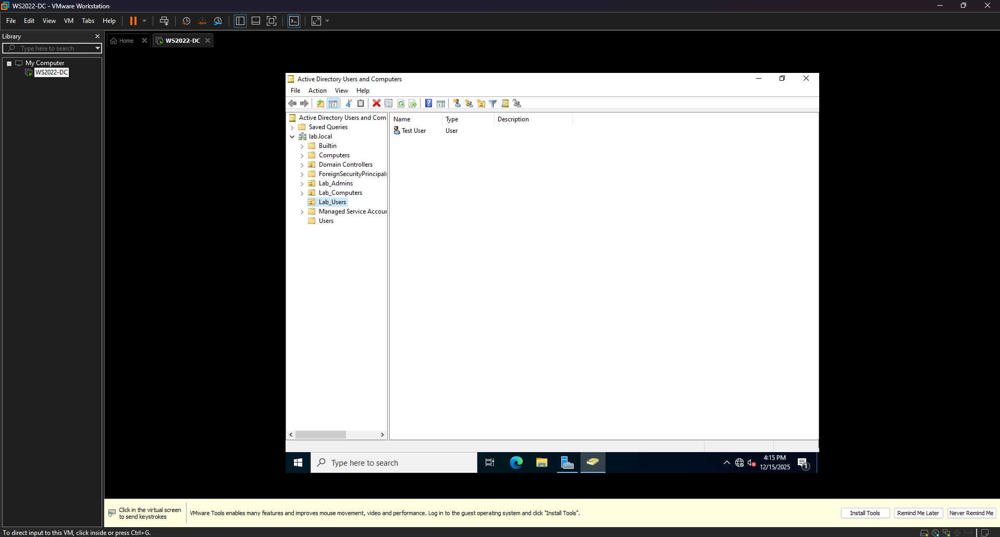
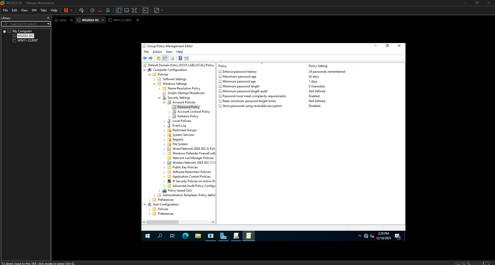
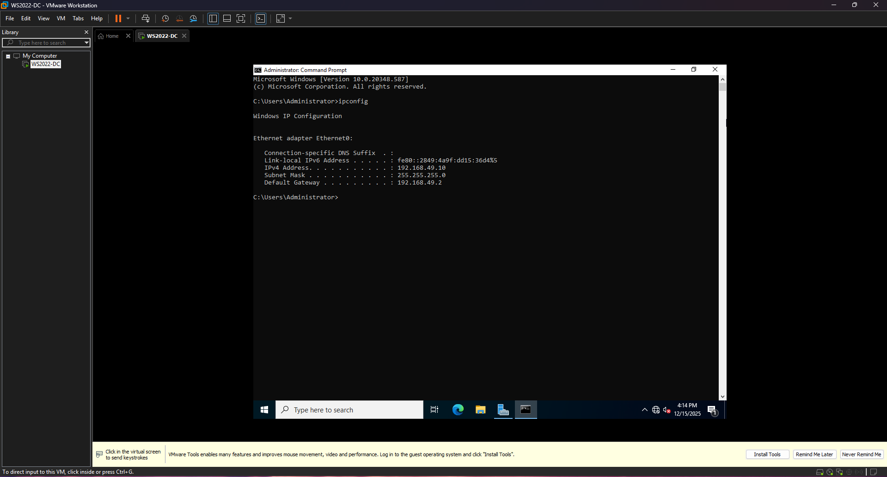
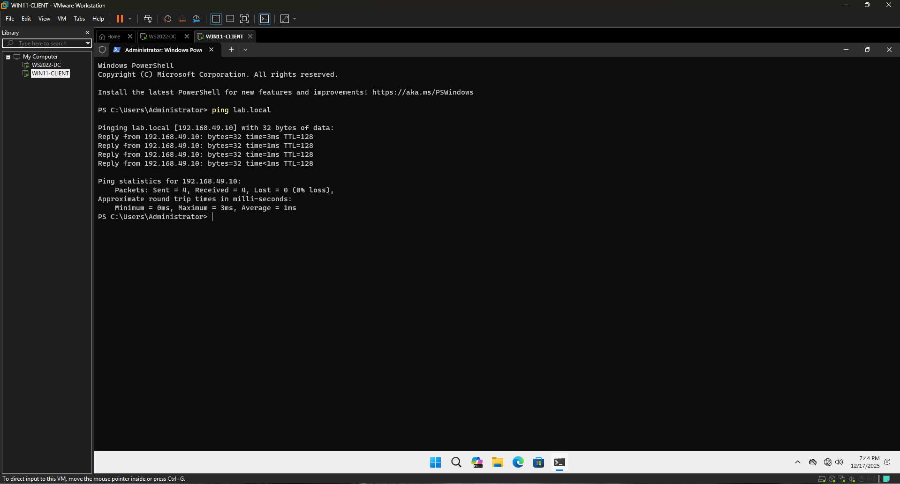
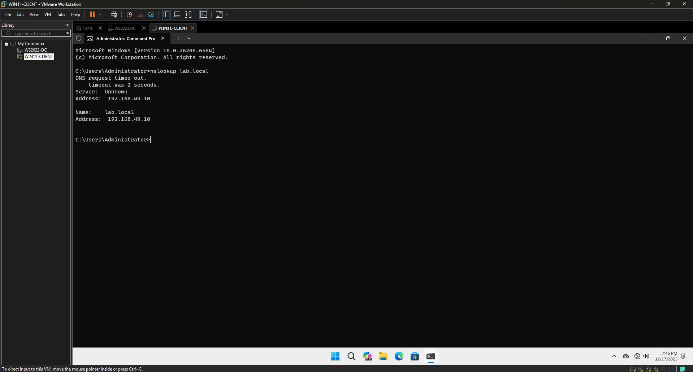
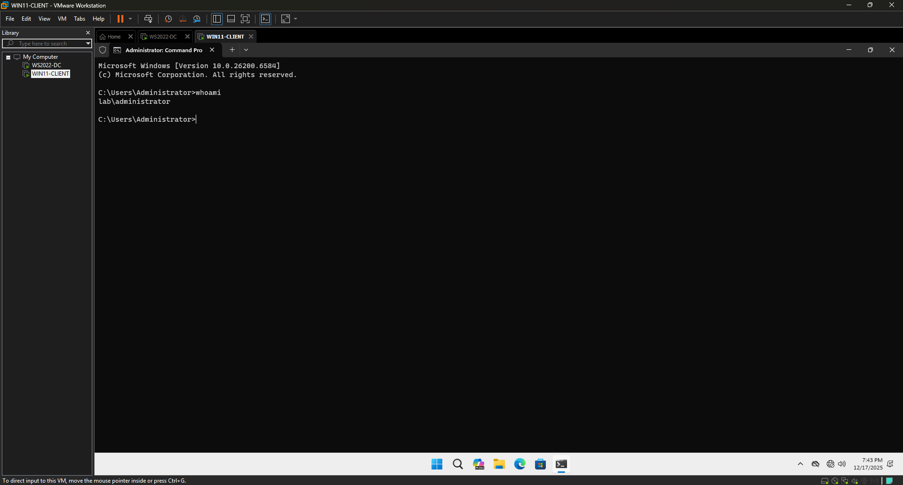

# Windows Server 2022 Active Directory Home Lab

> **Windows administration and blue-team lab:** a small Active Directory environment built to practice enterprise identity fundamentals, validation, and the next stage of security monitoring.

## What this project proves

- Deploying and administering Windows Server 2022 Active Directory Domain Services
- Designing a practical OU structure and managing domain identities
- Configuring AD-integrated DNS and static IPv4 networking
- Joining and validating a Windows 11 domain client
- Troubleshooting DNS and DHCP behavior in a virtualized NAT environment
- Documenting the lab as it evolves toward Windows event monitoring and detection

## Environment

| Component | Configuration |
|---|---|
| Hypervisor | VMware Workstation |
| Domain controller | Windows Server 2022 — `DC01` |
| Domain | `lab.local` |
| Client | Windows 11 — `WIN11-CLIENT` |
| Network | NAT / VMnet with static IPv4 addressing |
| Next security phase | Windows auditing and SIEM monitoring |

## Architecture

```
WIN11-CLIENT
     │  Domain authentication / DNS
     ▼
DC01 — AD DS + DNS
     │  Planned Windows event forwarding
     ▼
SIEM — Wazuh or Splunk Free (planned)
```

## Completed implementation

### Active Directory and identity management

- Installed AD DS and promoted `DC01` to a domain controller.
- Created separate OUs for users, computers, and administrators.
- Created and managed domain user accounts.
- Configured domain password-policy controls.





### Network and DNS configuration

- Assigned static IPv4 addressing for domain-controller stability.
- Configured AD-integrated DNS.
- Troubleshot DNS and DHCP conflicts in the virtualized network.



### Windows 11 domain client validation

- Created a Windows 11 VM and pointed its DNS to the domain controller.
- Resolved DNS and network-profile issues that prevented domain joining.
- Joined `WIN11-CLIENT` to `lab.local`.
- Validated DNS resolution and domain authentication with domain credentials.





## Blue-team expansion: current scope

The core identity lab is complete. The next phase turns it into a SOC-oriented Windows monitoring lab.

| Planned capability | Security value |
|---|---|
| Advanced Audit Policy on DC01 | Captures authentication, account-management, and group-change activity |
| Tiered admin and OU structure | Separates privileged activity from normal user activity |
| Repeatable test cases | Produces known-good telemetry for validation |
| SIEM agents on DC01 and WIN11-CLIENT | Centralizes Windows Security and System logs |
| Detections for failed logons, lockouts, new users, and admin-group changes | Builds practical triage and detection-engineering experience |

## Skills demonstrated

Active Directory · Windows Server 2022 · DNS · Group Policy fundamentals · Windows client administration · VMware · network troubleshooting · identity and access management

## Lessons learned

- Static addressing and correct DNS configuration are foundational before promoting a domain controller.
- Domain password policies override local expectations.
- DNS and DHCP issues can prevent domain joining even when the virtual machines appear connected.
- Screenshots and repeatable validation commands make a lab more credible and easier to troubleshoot.
- Snapshots, recovery documentation, and secure credential handling should be treated as part of the lab—not an afterthought.

## Status

**Complete:** AD DS, DNS, OU design, password policy, and Windows 11 domain join.  
**In progress:** security logging, test-event generation, and SIEM integration.  
**Not yet claimed:** production-grade monitoring or detections. These will be added only after implementation and validation.

## Disclaimer

This project is a controlled home-lab environment for educational and portfolio purposes. No production domain data or credentials are included.
